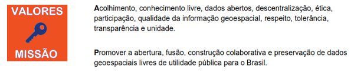
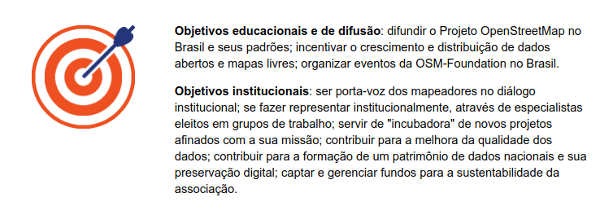
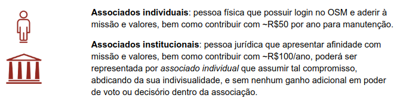
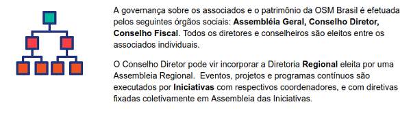

# Estatuto da OSM Brasi

Atualizado em 20/7/2018, versão 0.4.0. 

# RESUMO

Cláusulas [1.1](estatuto.md#146-denominacao-sede-duracao-e-valores-gerais) e [1.2.1](estatuto.md#12-atuacao-e-valores).

Cláusula [1.2.2](estatuto.md#12-atuacao-e-valores).

Cláusulas [2.2 e 2.2](estatuto.md#246-objetivos).

Cláusulas [3.1](estatuto.md#346-associados) e [3.2](estatuto.md#346-associados).

Cláusula [1.2.2](estatuto.md#746-governanca-e-estrutura).

...

Para maiores detalhes sobre o processo de construção do texo do estatuto, ver [processo de aprovação](processo.md).

